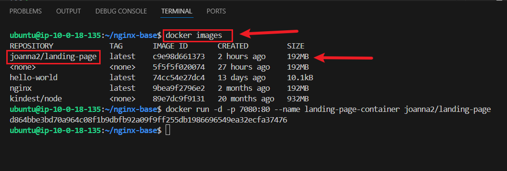

# Project Title: Containerization and Container Orchestration

## Introduction

As an aspiring DevOps engineer, understanding containerization and orchestration is crucial to managing modern software development workflows effectively. This project serves as a stepping stone in mastering key DevOps tools like Docker and Kubernetes. By containerizing a simple static website and orchestrating its deployment in a Kubernetes cluster, I aim to gain hands-on experience with core concepts of infrastructure automation, scalability, and deployment pipelines. This project will help me build the foundational skills required to handle real-world challenges in DevOps environments.

## Objectives

+ Develop Expertise in Containerization.

+ Familiarize with Docker Hub.

+ Set Up and Operate a Kubernetes Cluster.

+ Deploy and Manage Applications in Kubernetes

+ Enhance Debugging and Accessibility Skills

+ Learn best practices in containerization and orchestration to prepare for more advanced DevOps tools and workflows.

## Step-by-Step Implementation

### Step 1 : Project setup

+ Note: For this project, I am using Git Bash on a Windows workstation to execute these shell commands, as it provides a Unix-like command-line experience. Open your Git bash terminal.

### Step 1.1: Create project directory named Containerized-app and navigate into it.

**Commands:**

```
mkdir Containerized-app
cd Containerized-app
```

Press I(insert),:wq!(save and exit)

### Task 1.2: Build the web application

+ Create HTML and CSS files with the following content:

**index.html:**
command:

```
vim index.html
```


**style.css:**

```
vim style.css
```


### Step 2:

#### Task 2.1: Initialize Git Repository

+ Initialize, Add and Commit Git repository for version control

**Code**

```
git init
git add .
git commit -m "Initial commit - basic static website"
```


### Step 3: Task 4: Dockerize the Application

#### Tasks: Set up Docker

#### Task 3.1: Update the package manager and install Docker:

**Commands:**

```
sudo apt update -y
sudo apt upgrade -y
sudo apt install -y docker.io
```


### Task 3.2: Start, enable and check status of the Docker service:

**Commands:**

```
sudo service docker start
sudo systemctl enable docker
sudo systemctl status docker
```


### Task 3.3: Add the current user to the Docker group
          

**Command:**

```
sudo usermod -aG docker $USER
```

### Task 3.4: Verify the installation

**Command:**

```
docker --version
```


### Task 3.5: Step 2: Test Docker with a Simple Container

#### Run a test container to confirm Docker is operational:

```
sudo docker run hello-world
```


### Step 4: Create a Dockerfile

### Task 4.1: Create a working directory for your project:

**Command:**
```
mkdir ~/nginx-base
cd ~/nginx-base
```


### Task 4.2: Create a index.html and Write the index.html content:

Command:

```
nano index.hmtl
```

Save file using (Ctrl O,Enter,Ctrl X)

### Task 4.3: Create a styles.css and Write the styles.css content:

**Command:**

```
nano styles.css
```

Save file using (Ctrl O,Enter,Ctrl X)

### Task 4.4: Create a Dockerfile and Write the Dockerfile content:

**Command:**

```
nano Dockerfile
```


Save file using (Ctrl O,Enter,Ctrl X)

### Task 4:5 Build and Test the Docker Image

#### Build the Docker image:

**Command:**

```
docker build -t landing-page .
```


### Task 4:6: Verify the image build:

**Command:**

```
docker images
```



### Task 4.7: Run a container to test the image:

**Command:**

```
docker run -d -p 7080:80 --name landing-page-container joanna2/landing-page
```


### Task 4.8: Check if the container is running:

**Command:**

```
docker ps
```


### Task 4.9: Test the application: Open your browser or use curl to verify the application is running:

**Command:**

```
curl http://3.87.6.237
```
Screenshot: curl Status


ScreenShot: Browser Status


### Step 5: Push the Docker Image to Docker Hub

#### Task 5.1: Log in to Docker Hub

**Command:**

```
docker login
```


### Task 5.2: Tag your Docker image so it can be pushed to Docker Hub

**Command:**

```
docker tag c9e98d661373 landing-page:latest
```


### Task 5.3: Push the Image to Docker Hub

**Command:**

docker push joanna2/landing-page:latest


### Task 5.4: Verify the Image on Docker Hub

After the push is complete, you can verify it on Docker Hub:

+ log in to your Docker Hub account in your web browser.
+ Navigate to the "Repositories" section.
+ You should see your landing-page repository with the latest tag. 


### Step 6: Install Kind and Set Up a Kubernetes Cluster

Install Kind

Task 6.1: Download and install Kind:

**Commands:**

```
curl -Lo ./kind https://kind.sigs.k8s.io/dl/v0.20.0/kind-linux-amd64
chmod +x ./kind
sudo mv ./kind /usr/local/bin/kind
```


### Task 6.2: Verify the Kind installation:

**Command:**

```
kind --version
```


### Create a Kind Cluster

Task 6.3: Create the Kubernetes cluster:

Command:

```
kind create cluster --name landing-cluster
```


### Task 6.4: Install Kubernetes CLI (kubectl) and Check the cluster status:

**Command**

```
curl -LO "https://dl.k8s.io/release/$(curl -L -s https://dl.k8s.io/release/stable.txt)/bin/linux/amd64/kubectl"
chmod +x ./kubectl
sudo mv ./kubectl /usr/local/bin/kubectl
kubectl cluster-info
```

### Task 6.5: Verify the cluster nodes:

**Command:**

```
kubectl get nodes
```

### Step 7: Deploy the Application to Kubernetes

### Task 7.1: Create a Kubernetes Deployment YAML file

Create a file named deployment.yaml with the following content:

**Command:**
```
nano deployment.yaml
```


### Task 7.2: Apply the Deployment to the Cluster

+ **Apply the deployment:**

**Command:**

```
kubectl apply -f deployment.yaml
```


+ **Verify the pods:**

**Command:**

```
kubectl get pods
```


### Step 8: Create a Service (ClusterIP)

### Task 8.1: Create a Service YAML file

+ Create a file named service.yaml with the following content:


### Task 8.2: Apply the Service to the Cluster

+ **Apply the service:**

**Command:**

```
kubectl apply -f service.yaml
```


+ **Verify the service:**
**Command:**

```
kubectl get services
```


### Step 9: Access the Application

### Task 9.1: Forward the Port to Access Locally:

+ **Forward the port of the nginx-service to your local machine:**

**Command:**

```
 kubectl port-forward --address 0.0.0.0 service/capstone-service 8080:80
```


+ **Open your browser and visit:**

**Command:**

```
http://3.87.6.237:8080
```


### Check the Logs (Optional)

+ To check the logs of the running pods:

Command:

```
kubectl logs capstone-deployment-84d8cbb667-v7f74
```


### Step 10: Stage, Commit, and Push Your Project to GitHub

### Task 10.1: Stage and Commit the Template to Git

In this step, I will add the website files to the Git repository, configure my global Git settings, and make an initial commit with a descriptive message.

+ **Add Files:** Add all website files to the staging area.

+ **Configure Git User Information:** Set up global configuration with my actual git username and email address.

+ **Commit Changes:** Commit the changes with a clear and descriptive message.

**Commands:**

```
git add .
git config --global user.name "YourUsername"
git config --global user.email "youremail@example.com"
git commit -m "Initial commit for static web app"
```


### Task 10.2: Push the code to your Github repository

After initializing your Git repository and adding your e-commerce website template, the next step is to push your code to a remote repository on GitHub. This step is crucial for version control and collaboration.

+ Create a Remote Repository on GitHub: Log into your GitHub account and create a new repository named Containerization-Project. Leave the repository empty without initializing it with a README, .gitignore, or license. 


**Commands:**

```
git remote add origin https://github.com/Joy-it-code/containerized-app.git
git branch -M main
git push -u origin main
```
 